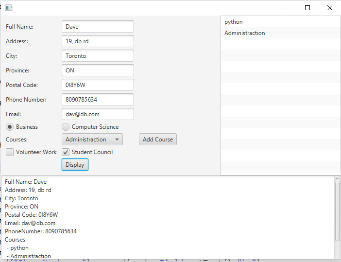
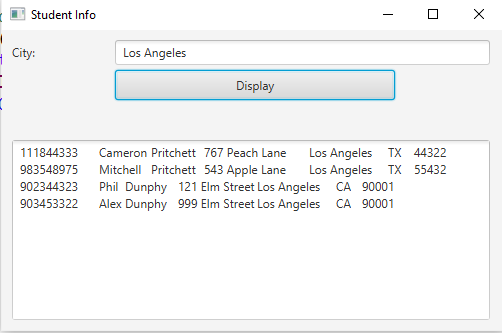
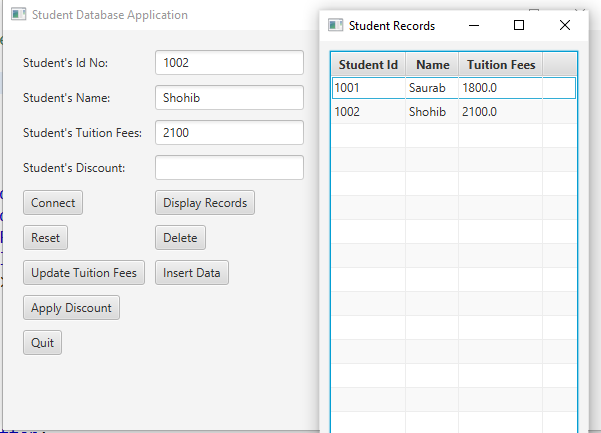
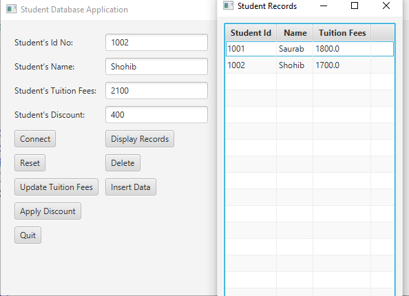

# JavaProjects
# Student UI
Using JavaFX UI is created where the User gets to give the input as per his needs. Validation is done for Phone Number and Email to ensure right format is entered.

# City Based Filter Using JDBC and JavaFX
Using JavaFX UI is created where the User gets to give the city name as input. JDBC has the data and the relevant data will be displayed in the text area. If city not found, an exception will be thrown.

# Student Tuition Fees
JavaFX for creating UI, JDBC is used for connecting the DataBase. The User needs first need to connect, enter all the fields and insert, then display. To apply the discount, the user needs to click the apply discount and the output will reflect automatically.

<b>Fees before Discount<\b> 

<b>Fees after Discount<\b> 

# MediaPlayer
Using Media, GridPane and BorderPane the player is created. The user can open any mp4 dynamically. Has the ability to move forward & backward, adjust volume, increase/decrease speed

